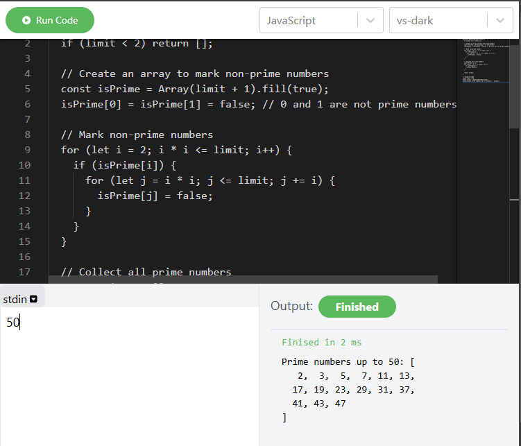
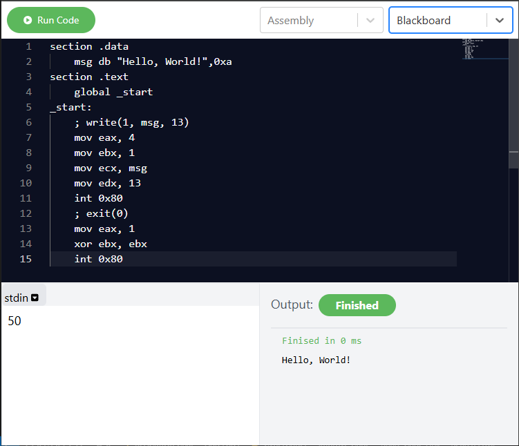

# Coding Playground

This is a web-based platform designed to simulate the LeetCode coding environment, where users can write, run, and test their code in real-time.

## Features
- **Code editor** with syntax highlighting
- **Real-time code execution** and output display
- **Problem-solving** interface similar to LeetCode
- **Multi-language and Theme Support** can change language and theme as user wish.

## Screenshots
  

  


## Installation

Follow these steps to set up the project locally:

1. **Clone the repository**:
   ```bash
   git clone https://github.com/yourusername/coding_playground.git
   ```
   
2. **Navigate to the project directory**:
   ```bash
   cd coding_playground
   ```

3. **Install dependencies**:
   ```bash
   npm install
   ```

4. **Run the development server**:
   ```bash
   npm start
   ```

The app should now be accessible at `http://localhost:3000`.

